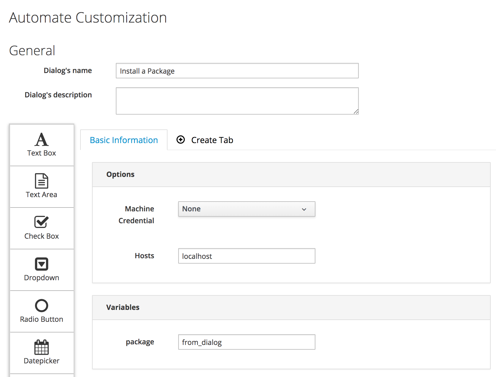
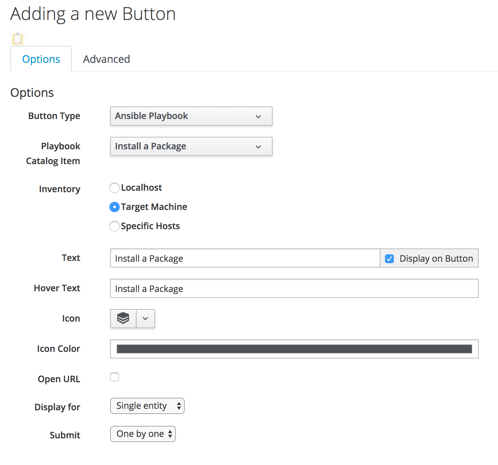
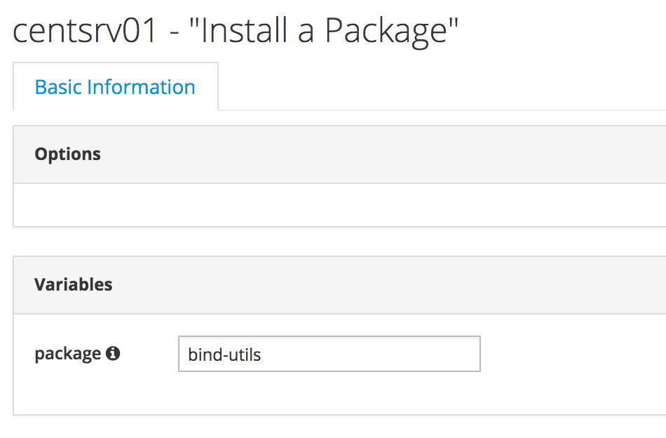

# Running an Embedded Ansible Playbook Service on a VM from a Button

In this example we’ll create a button on a VM that can be used to
install an RPM package on the VM, via an Ansible playbook.

Second example: custom attribute to the VM object

CloudForms 4.6 adds a new feature called Button Type to custom buttons. One of the available button types is Ansible Playbook, which allows an existing Ansible playbook service to be run on the object (VM, Host etc) displaying the button in the WebUI. This button type still calls the /System/Request/Order_Ansible_Playbook instance to launch the playbook service, but it simplifies the process of creating the parameters that the order_ansible_playbook method uses.

For this example a simple playbook is run that installs a package using the yum module onto the VM displaying the custom button.

``` yaml
---
- name: Install Package
  hosts: all
  vars: 
    package: from_playbook

  tasks:
  - name: Install package
    yum: name={{ package }} state=present
```

A default value of 'from_playbook' for the package variable is defined for the purposes of troubleshooting.

## Pre-Requisites
This example assumes that the following pre-requisites have been created:

* The Git repository containing the playbook has been added to embedded Ansible Automation.
* A machine credential has been created that allows ssh access to the target VM. For this example an ssh key is used to connect to the target as the user ansible-remote. The credential uses sudo privilege escalation to run as root.

To assist in troubleshooting, a call to object\_walker has been made from the _/System/Request/Order\_Ansible\_Playbook_ instance (to view the arguments passed to the _order\_ansible\_playbook_ method), and from the _/Service/Generic/StateMachines/GenericLifeCycle/provision_ service provision state machine.

## Creating the Service

The Ansible playbook service was first created, as follows:


### Values Selected

The following parameter values were selected:

* **Machine Credential** -  The ansible-remote user machine credential defined earlier (this can be overridden when the playbook is run)
* **Hosts** - Localhost (this will be overridden when the playbook is run)
* **Escalate Privilege** - Yes (installing a package requires root privileges)
* **Variables & Default Values** - Add the _package_ variable with a default value of 'from_service'
* **Dialog** - Create New

> **Note**
>
> Defining the playbook variables here with default values ensures that they are added to the newly created service dialog correctly.

Clicking **Save** creates both the new service and service dialog.

### Editing the Service Dialog

If the newly created service dialog is edited, it can be seen that the package element has been given the correct name "param\_package" (as required by the _order\_ansible\_playbook_ method), and the default value of "from\_service". For this example we'll change the default value for the dialog element to "from\_dialog", as follows:



Once the dialog has been created, the only use for the package variable and value in the service definition is to provide a fallback in case the package is not specified in the dialog. It can otherwise be deleted.

### Creating the Button

The button was created as follows:




### Values Selected

The following parameter values were selected:

* **Button Type** - Ansible Playbook
* **Playbook Catalog Item** - The service catalog item created earlier
* **Inventory** - Target Machine


For this example the values in the **Advanced** tab were left as default.

The selection of a button dialog is not available for an Ansible Playbook type button as the dialog for the service is used.

## Testing the Button

The button can be tested with several permutations of dialog values so that the input parameters can be examined.

### Test 1

Leave the **Machine Credential** and **Hosts** elements at their defaults. Specify "screen" as the package:


The package installs successfully, the Ansible output shows:

```
TASK [Install package] *********************************************************
ok: [192.168.1.66]

PLAY RECAP *********************************************************************
192.168.1.66               : ok=6    changed=1    unreachable=0    failed=0‍‍‍‍‍‍‍‍‍‍‍‍‍‍‍‍‍‍‍‍‍‍‍‍‍‍‍‍‍‍‍‍‍‍‍‍‍‍‍‍‍‍‍‍‍‍‍‍‍‍‍‍‍‍‍‍‍‍‍‍‍‍‍‍‍‍‍‍‍‍‍‍‍‍‍‍‍‍‍‍‍‍‍‍‍‍‍‍‍‍‍‍‍‍‍‍
```
‍
The following `$evm.root` parameters have been created as inputs for order\_ansible\_playbook:

```
$evm.root['dialog_hosts'] = localhost   (type: String)
$evm.root['dialog_param_package'] = screen   (type: String)
$evm.root['hosts'] = vmdb_object   (type: String)
```

It can be seen that no value for machine credential has been passed, so the default value defined in the service catalog item has been used.

The service provision state machine options hash is as follows:

```
$evm.root['service'].options[:config_info] = {:provision=>{:repository_id=>"4", :playbook_id=>"182", :credential_id=>"11", :hosts=>"localhost", :verbosity=>"0", :log_output=>"on_error", :extra_vars=>{:package=>{:default=>"from_service"}}, :execution_ttl=>"", :become_enabled=>true, :new_dialog_name=>"Install a Package", :fqname=>"/Service/Generic/StateMachines/GenericLifecycle/provision", :dialog_id=>31}, :retirement=>{:remove_resources=>"yes_without_playbook", :verbosity=>"0", :log_output=>"on_error", :fqname=>"/Service/Generic/StateMachines/GenericLifecycle/Retire_Basic_Resource"}}   (type: Hash)
$evm.root['service'].options[:dialog] = {"dialog_credential"=>nil, "dialog_hosts"=>"192.168.1.66", "dialog_param_package"=>"screen"}   (type: Hash)
$evm.root['service'].options[:provision_job_options] = {"hosts"=>"192.168.1.66", "extra_vars"=>{"package"=>"screen"}, "inventory"=>38}   (type: ActiveSupport::HashWithIndifferentAccess)
```
‍
It can be seen that order\_ansible\_playbook has used the IP address of the 'current' VM in the call to `$evm.execute('create_service_template_request',...)`. This is the default action if $evm.root['hosts'] has been defined as "vmdb_object".

### Test 2

Set the **Machine Credential** to "SSH Key (ansible-remote)" but leave the **Hosts** element at its default. Specify "screen" as the package:

The playbook runs successfully:

```
TASK [Install package] *********************************************************
ok: [192.168.1.66]

PLAY RECAP *********************************************************************
192.168.1.66               : ok=6    changed=0    unreachable=0    failed=0...
```

The selected credential object ID is included as one of the $evm.root inputs for order\_ansible\_playbook:

```
$evm.root['dialog_credential'] = 11   (type: String)
$evm.root['dialog_hosts'] = localhost   (type: String)
$evm.root['dialog_param_package'] = screen   (type: String)
$evm.root['hosts'] = vmdb_object   (type: String)
```

The service provision state machine options hash is as follows:

```
$evm.root['service'].options[:config_info] = {:provision=>{:repository_id=>"4", :playbook_id=>"182", :credential_id=>"11", :hosts=>"localhost", :verbosity=>"0", :log_output=>"on_error", :extra_vars=>{:package=>{:default=>"from_service"}}, :execution_ttl=>"", :become_enabled=>true, :new_dialog_name=>"Install a Package", :fqname=>"/Service/Generic/StateMachines/GenericLifecycle/provision", :dialog_id=>31}, :retirement=>{:remove_resources=>"yes_without_playbook", :verbosity=>"0", :log_output=>"on_error", :fqname=>"/Service/Generic/StateMachines/GenericLifecycle/Retire_Basic_Resource"}}   (type: Hash)
$evm.root['service'].options[:dialog] = {"dialog_credential"=>"11", "dialog_hosts"=>"192.168.1.66", "dialog_param_package"=>"screen"}   (type: Hash)
$evm.root['service'].options[:provision_job_options] = {"hosts"=>"192.168.1.66", "extra_vars"=>{"package"=>"screen"}, "credential"=>"4", "inventory"=>39}   (type: ActiveSupport::HashWithIndifferentAccess)
```

It can be seen that the dialog\_credential dialog option is no longer nil in the options hash.

### Test 3

Set the **Machine Credential** to "CFME Default Credential" but leave the **Hosts** element at its default. Specify "screen" as the package:

As expected the playbook fails to run as the credential is invalid for the VM selected:

```
TASK [Gathering Facts] *********************************************************
fatal: [192.168.1.66]: UNREACHABLE! => {"changed": false, "msg": "Failed to connect to the host via ssh...
```

### Test 4

Make the **Machine Credential** and **Hosts** elements non-visible in the dialog to force the default values to be submitted. Specify "bind-utils" as the package:



The package installation was successful:

```
TASK [Install package] *********************************************************
changed: [192.168.1.66]

PLAY RECAP *********************************************************************
192.168.1.66               : ok=6    changed=1    unreachable=0    failed=0‍‍‍‍‍‍‍‍‍‍‍‍‍‍‍‍‍‍‍‍‍‍‍‍‍‍‍‍‍‍‍‍‍‍‍‍‍‍‍‍‍‍‍‍‍‍‍‍‍‍‍‍‍‍‍‍‍‍‍‍‍‍‍‍‍
```

The `$evm.root` inputs for order\_ansible\_playbook are just as when the elements were visible. 

The default values are submitted:

```
$evm.root['dialog_hosts'] = localhost   (type: String)
$evm.root['dialog_param_package'] = bind-utils   (type: String)
$evm.root['hosts'] = vmdb_object   (type: String)
```

The service options hash is unaffected by the hiding of the dialog elements:

```
$evm.root['service'].options[:config_info] = {:provision=>{:repository_id=>"4", :playbook_id=>"182", :credential_id=>"11", :hosts=>"localhost", :verbosity=>"0", :log_output=>"on_error", :extra_vars=>{:package=>{:default=>"from_service"}}, :execution_ttl=>"", :become_enabled=>true, :new_dialog_name=>"Install a Package", :fqname=>"/Service/Generic/StateMachines/GenericLifecycle/provision", :dialog_id=>31}, :retirement=>{:remove_resources=>"yes_without_playbook", :verbosity=>"0", :log_output=>"on_error", :fqname=>"/Service/Generic/StateMachines/GenericLifecycle/Retire_Basic_Resource"}}   (type: Hash)
$evm.root['service'].options[:dialog] = {"dialog_credential"=>nil, "dialog_hosts"=>"192.168.1.66", "dialog_param_package"=>"bind-utils"}   (type: Hash)
$evm.root['service'].options[:provision_job_options] = {"hosts"=>"192.168.1.66", "extra_vars"=>{"package"=>"bind-utils"}, "inventory"=>42}   (type: ActiveSupport::HashWithIndifferentAccess)
```

### Test 5

Delete the **Options** box containing the **Machine Credential** and **Hosts** elements in the dialog. Specify "nfs-utils" as the package:


The package installation failed:

```
TASK [Gathering Facts] *********************************************************
fatal: [localhost]: FAILED! => {"changed": false, "failed": true,...
```

The `$evm.root` inputs for order\_ansible\_playbook are as follows:

```
$evm.root['dialog_param_package'] = nfs-utils   (type: String)
$evm.root['hosts'] = vmdb_object   (type: String)
```

The service options hash shows that without the dialog\_hosts value, the package installation was attempted on localhost, which was the default when the service catalog item was created:

