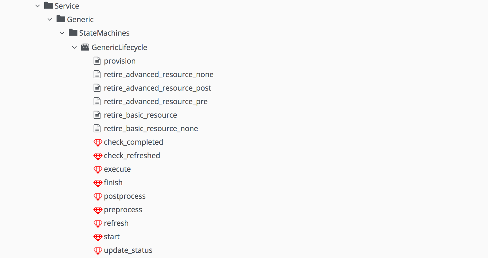

# Ansible Service Provisioning and Retirement State Machines

An Ansible playbook service has a new type of Active Record object (_ServiceAnsiblePlaybook_) and a corresponding auto-generated service model object (_MiqAeServiceServiceAnsiblePlaybook_). A new simplified service lifecycle state machine class had been developed to handle Ansible playbook services using the features and methods of the ServiceAnsiblePlaybook object. 

The new state machine instances still reference many of the original service lifecycle instance and methods under _/Service/Provisioning_ and _/Service/Retirement_ in the automate datastore, but several new methods are included to handle the ServiceAnsiblePlaybook object-specific processing (see [New GenericLifecycle Class](#i1))

## Service Provisioning State Machine

There is a single generic service provisioning state machine.

### provision

The **provision** state machine runs the provisioning playbook and creates a new service in the **Active Services** folder of the **Services** accordion in **Services -> My Services** in the WebUI.

## Service Retirement State Machines

There are several service retirement state machines split into two categories: _basic resource_ - for services that don't have a retirement playbook - and _advanced resource_, for services that do. A retired service is moved into the **Retired Services** folder of the **Services** accordion in **Services -> My Services** in the WebUI.

### Basic Resource

The _basic resource_ retirement state machines are used if the service catalog item definition doesn't specify a retirement playbook to run. The selection of state machine is automatic and depends on the configured value for the **Remove Resources?** dropdown in the **Retirement** tab of the service definition (see [Remove Resources? Dropdown](#i2))

The state machines are as follows:

#### retire\_basic\_resource\_none

The **retire\_basic\_resource\_none** state machine is the simplest service retirement state machine. It retires the service, and leaves untouched any service resources such as VMs.

#### retire\_basic\_resource

The **retire\_basic\_resource** state machine retires the service, but also attempts to retire any VMs under this top level service.

### Advanced Resource

The _advanced resource_ retirement state machines are used if the service catalog item definition specifies a retirement playbook to be run. The selection of state machine is automatic, once again depending on the configured value for the **Remove Resources?** dropdown.

The state machines are as follows:

#### retire\_advanced\_resource\_none

The **retire\_advanced\_resource\_none** state machine retires the service and runs the service retirement playbook, but leaves untouched any service resources such as VMs.

#### retire\_advanced\_resource\_pre

The **retire\_advanced\_resource\_pre** state machine retires the service and any VMs under this top level service, and then finally runs the service retirement playbook.

#### retire\_advanced\_resource\_post

The **retire\_advanced\_resource\_post** state machine retires the service, runs the service retirement playbook, and then finally attempts to retire any VMs under this top level service.

> **Note**
> 
> Any dynamic playbook variables or hosts used for the service provision - for example passed from a service dialog - are not available when the retirement playbooks are run. The static values configured in the **Retirement** tab of the service definition are used to run the retirement playbook.

## Summary

This chapter has described the new state machines that handle the provisioning and retirement of embedded Ansible playbook services. They can be cloned to a user-defined domain and edited to extend functionality, if required.