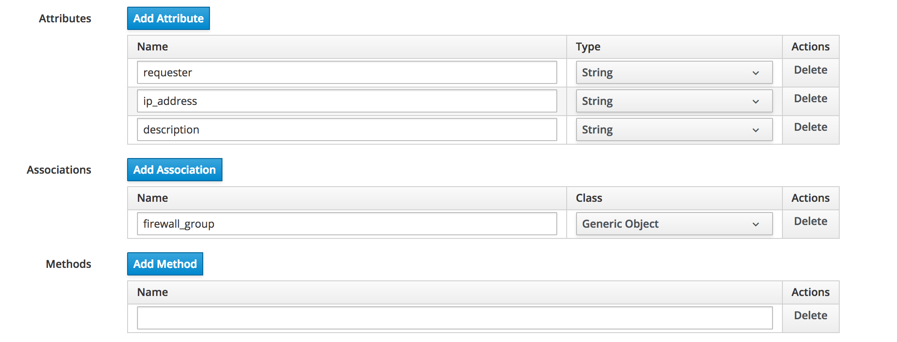
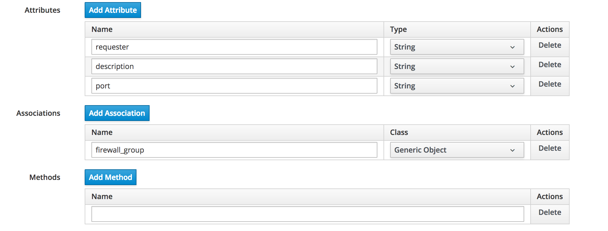
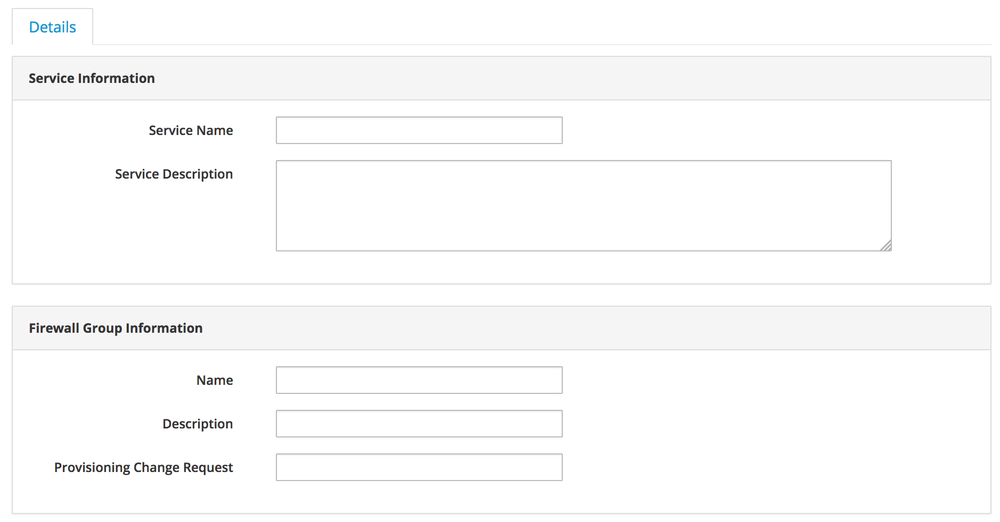
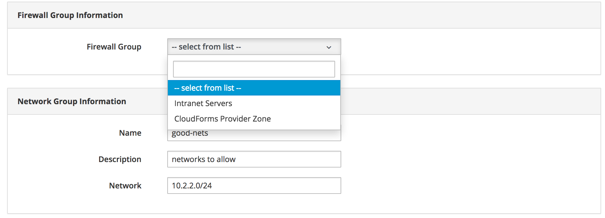
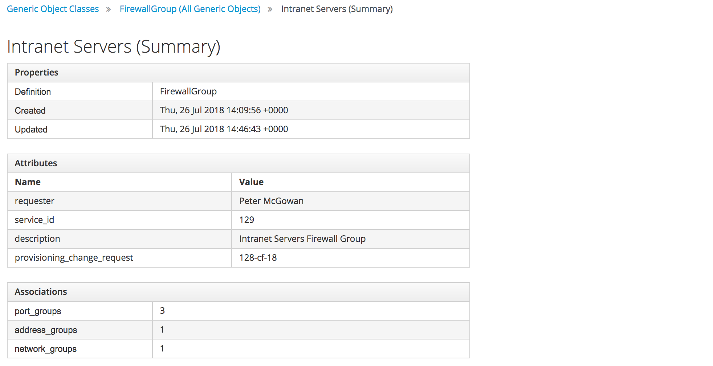
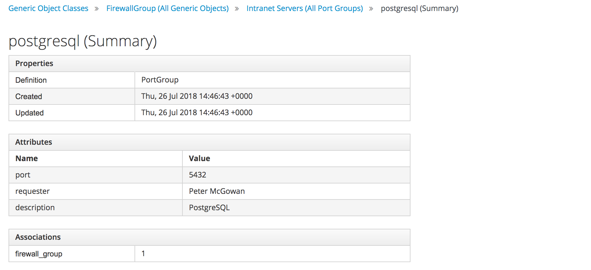

# Generic Object Example

In this example we'll use generic objects to represent the components that make up a software-defined networking firewall definition. 

The firewall software uses the concept of firewall groups to define rules for allowed and denied network connectivity. The firewall groups comprise one or more address groups, network groups and port groups. A typical group definition on the firewall might be as follows:


```
# show firewall
 group {
     address-group servers {
         description "servers to allow"
         address 192.168.1.1-192.168.1.10
         address 192.168.1.7
         address 172.16.3.3
     }
     network-group good-nets {
         description "networks to allow"
         network 10.2.3.0/24
     }
     port-group allowed-ports {
         description "ports to allow"
         port 22
         port 80
         port 443
     }
 }
```

To represent each of these firewall components in the CloudForms VMDB we'll create 4 new generic object class definitions, as follows:

* Firewall Group
* Address Group
* Network Group
* Port Group

The Firewall Group generic object has associations to one or more of each of the other three generic object types. The Address Group, Network Group and Port Group object types have a single association back to their related Firewall Group.

> **Note**
> 
> For simplicity of illustration, the code that connects to the external software defined firewall service to implement the firewall is not shown. 

The Generic Object class definitions are as follows:

### Firewall Group

The Firewall Group generic object class definition is shown in screenshot [Firewall Group Generic Object Definition](#i1)


### Address Group

The Address Group generic object class definition is shown in screenshot [Address Group Generic Object Definition](#i2)



### Network Group

The Network Group generic object class definition is shown in screenshot [Network Group Generic Object Definition](#i3)


### Port Group

The Port Group generic object class definition is shown in screenshot [Port Group Generic Object Definition](#i4)



## Provisioning the Generic Objects

The generic objects are provisioned individually.

### Firewall Group

A Firewall Group generic object is provisioned from a service. The service dialog is shown in screenshot [Service Dialog - Ordering a Firewall Group](#i5)



The Ansible playbook service runs the following playbook:

``` yaml
---
- name: Create Firewall Group
  hosts: localhost

  vars:
  - go_name: "{{ 'FirewallGroup'|urlencode }}"

  tasks:
  - name: Find the "FirewallGroup" generic object definition
    uri:
      url: "{{ manageiq.api_url }}/api/generic_object_definitions?expand=resources&filter[]=name='{{ go_name }}'"
      method: GET
      validate_certs: no
      headers:
        X-Auth-Token: "{{ manageiq.api_token }}"
      body_format: json
    register: go_definition
    
  - set_fact:
      go_definition_href: "{{ go_definition.json.resources[0].href }}"
  
  - name: Lookup the requesting user
    uri:
      url: "{{ manageiq.api_url }}/api/{{ manageiq.user }}"
      method: GET
      validate_certs: no
      headers:
        X-Auth-Token: "{{ manageiq.api_token }}"
      body_format: json
    register: requester
    
  - set_fact:
      requester_name: "{{ requester.json.name | default('') }}"
  
  - name: Create the generic object entry
    uri:
      url: "{{ manageiq.api_url }}/api/generic_objects"
      method: POST
      validate_certs: no
      headers:
        X-Auth-Token: "{{ manageiq.api_token }}"
      body_format: json
      body:
        action: create
        name: "{{ firewall_group_name }}"
        generic_object_definition:
          href: "{{ go_definition_href }}"
        property_attributes:
          requester: "{{ requester_name }}"
          service_id: "{{ manageiq.service.split('/')[1] }}"
          description: "{{ firewall_group_description }}"
          provisioning_change_request: "{{ provisioning_change_request }}"
    register: new_go
    
  - set_fact:
      new_go_href: "{{ new_go.json.results[0].href }}"
    
  - name: Register the new generic object with the service
    uri:
      url: "{{ manageiq.api_url }}/api/{{ manageiq.service }}"
      method: POST
      validate_certs: no
      headers:
        X-Auth-Token: "{{ manageiq.api_token }}"
      body_format: json
      body:
        action: add_resource
        resource:
          resource:
            href: "{{ new_go_href }}"
    register: output
```

### Address Group, Network Group and Port Group

The Address Group, Network Group and Port Group objects are each created by a Ruby method written to be callable either from a button on the firewall group's generic object, or from a service provision state machine. 

For example the following code snippet creates the Network Group generic object:

``` ruby
$evm.log(:info, "*** In create_network_group ***")
go_class = $evm.vmdb(:generic_object_definition).find_by_name("NetworkGroup")

case $evm.root['vmdb_object_type']
when 'generic_object'
  name           = $evm.root['dialog_name']
  network        = $evm.root['dialog_network']
  description    = $evm.root['dialog_description']
  requester      = $evm.root['user'].name
  firewall_group = $evm.root['generic_object']
when 'service_template_provision_task'
  task           = $evm.root['service_template_provision_task']
  name           = task.dialog_options['dialog_name']
  network        = task.dialog_options['dialog_network']
  description    = task.dialog_options['dialog_description']
  requester      = task.miq_request.requester.name
  firewall_group = $evm.vmdb('generic_object', task.dialog_options['dialog_firewall_group'])
end

new_go = go_class.create_object(:name        => name,
                                :network     => network,
                                :description => description,
                                :requester   => requester)
new_go.firewall_group = [firewall_group]
new_go.save!
firewall_group.network_groups += [new_go]
firewall_group.save!

# Update the service
unless $evm.root['service'].blank?
  new_go.add_to_service($evm.root['service'])
  $evm.root['service'].name = "Firewall Network Group: #{name}"
end
```

If the Address Group, Network Group and Port Group objects are provisioned from a service, their related Firewall Group should already exist. The Firewall Group with which to associate the new generic object is selected from a dynamic drop-down in the service dialog (see screenshot [Service Dialog - Ordering a Network Group](#i6)).



The dynamic drop-down element is populated by the following Ruby method:

``` ruby
begin
  values_hash = {}
  values_hash['!'] = '** no firewall groups found **'
  firewall_groups = $evm.vmdb(:GenericObject).all
  unless firewall_groups.empty?
    values_hash['!'] = '-- select from list --'
    firewall_groups.each do | group |
      if group.generic_object_definition_name == 'FirewallGroup'
        values_hash[group[:id]] = group[:name]
      end
    end
  end

  list_values = {
    'sort_by'    => :value,
    'data_type'  => :string,
    'required'   => true,
    'values'     => values_hash
  }
  list_values.each { |key, value| $evm.object[key] = value }

 rescue => err
  $evm.log(:error, "[#{err}]\n#{err.backtrace.join("\n")}")
  exit MIQ_STOP
end
```

## Completed Objects

Once completed the generic objects provide a graphical represntation of the firewall groups. [Firewall Groups](#i7) shows the top-level firewall groups.


Clicking on the named link for a firewall group navigates to the details of that firewall group generic object (see screenshot [Firewall Group Details](#i8)).



Clicking on the **port_groups** association shows the generic objects representing the individual port groups (see screenshot [Port Groups](#i9)).


Clicking on the named link for a port group navigates to the details of the port group. The association back to the firewall group can be seen (and can be clicked to navigate back if required) (see screenshot [Port Group Details](#i10)).



## Summary

This chapter has illustrated how generic objects can be used to model external entities using CloudForms VMDB objects, including modelling the relationships between entities as associations between objects. The scripts are available [here](https://github.com/pemcg/mastering-automation-addendum-for-cloudforms-4.6/tree/master/generic_object_example/scripts)


