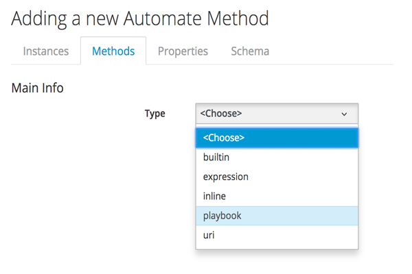
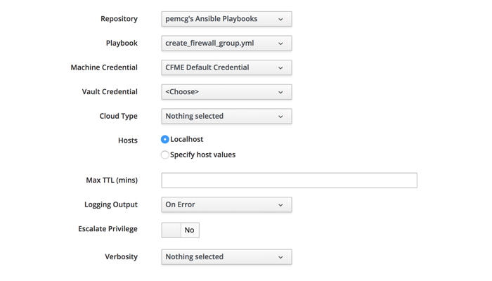

# Ansible Playbook Methods

CloudForms 4.6 / ManageIQ *Gaprindashvili* has introduced the capability to run Ansible playbooks as automation methods. It is now possible to mix Ruby and/or Ansible methods in a single state machine or instance.

## Creating a Playbook Method

A playbook method is created in the same way as other automate
methods. CloudForms 4.6 (ManageIQ *Gaprindashvili*) has added two more
method types, one of which is *playbook* (see
[Adding a New Playbook Method](#i1))

[//]: # ()

_** screenshot here 'Method Types' **_


[//]: # ()

_** screenshot here 'Adding the Method Name' **_


[//]: # ()

_** screenshot here 'Completing the Method Details' **_


## Variables Available to the Ansible Playbook

When an Ansible playbook is run as an automate method, a number of manageiq-specific variables are made available to the playbook to use. These are similar to the variables available to a playbook service, but with the addition of the **automate\_workspace** variable that allows the playbook to interact with the `$evm` workspace managing the automation workflow.

``` yaml
"manageiq": {
    "X_MIQ_Group": "EvmGroup-super_administrator",
    "api_token": "4b90eb34f6374f5d61c16c969b53f018",
    "api_url": "https://10.2.3.4",
    "automate_workspace": "automate_workspaces/cf7df7bd-b871-46e3-a634-a3c30d644e5c",
    "group": "groups/2",
    "user": "users/1"
},
"manageiq_connection": {
    "X_MIQ_Group": "EvmGroup-super_administrator",
    "token": "4b90eb34f6374f5d61c16c969b53f018",
    "url": "https://10.2.3.4"
}
```


## Workspace

This is the json contents of the automate workspace as retrieved in the playbook:

``` yaml
"json": {
    "actions": [
        {
            "href": "https://10.2.3.4/api/automate_workspaces/7bd6c913-7366-...",
            "method": "post",
            "name": "edit"
        },
        {
            "href": "https://10.2.3.4/api/automate_workspaces/7bd6c913-7366-...",
            "method": "post",
            "name": "encrypt"
        },
        {
            "href": "https://10.2.3.4/api/automate_workspaces/7bd6c913-7366-...",
            "method": "post",
            "name": "decrypt"
        }
    ],
    "guid": "7bd6c913-7366-4d10-acf4-61af57465c75",
    "href": "https://10.2.3.4/api/automate_workspaces/7bd6c913-7366-...",
    "id": "63",
    "input": {
        "current": {
            "class": "twostate",
            "instance": "test",
            "message": "create",
            "method": "workspace_test",
            "namespace": "Bit63/statemachines"
        },
        "method_parameters": {},
        "objects": {
            "/Bit63/statemachines/twostate/test": {
                "::miq::parent": "/ManageIQ/System/Request/call_instance"
            },
            "/ManageIQ/System/Request/call_instance": {
                "::miq::parent": "root"
            },
            "root": {
                "ae_next_state": "",
                "ae_provider_category": "unknown",
                "ae_result": "ok",
                "ae_retry_server_affinity": false,
                "ae_state": "execute2",
                "ae_state_max_retries": 0,
                "ae_state_retries": 0,
                "ae_state_started": "2018-04-24 10:49:37 UTC",
                "ae_state_step": "main",
                "class": "twostate",
                "instance": "test",
                "message": "create",
                "miq_group": "href_slug::groups/2",
                "miq_server": "href_slug::servers/1",
                "miq_server_id": "1",
                "namespace": "statemachines",
                "object_name": "Request",
                "request": "call_instance",
                "tenant": "href_slug::tenants/1",
                "user": "href_slug::users/1",
                "user_id": "1"
            }
        },
        "state_vars": {
            "date_stamp": "2018-04-24 11:49:37 +0100"
        }
    },
    "tenant_id": "1",
    "user_id": "1"
}
```

## Argument Passing and Returning

As with a Ruby method, static or dynamic values can be passed as
arguments into a playbook method, and the playbook can return values
back to $evm to be used in subsequent stages of a workflow.

### Arguments

Values can also be retrieved from state\_vars

``` Ruby
$evm.set_state_var(:date_stamp, "#{Time.now}")
```

``` yaml
---
- name: Example of Workspace interaction - reading a state_var
  hosts: localhost
  connection: local

  vars:
  - manageiq_validate_certs: false
  - auto_commit: true

  roles:
  - syncrou.manageiq-automate

  tasks:
  - name: Connect to workspace using token
    uri:
      url: "{{ manageiq.api_url }}/api/{{ manageiq.automate_workspace }}"
      method: GET
      validate_certs: no
      headers:
        X-Auth-Token: "{{ manageiq.api_token }}"
      body_format: json
    register: output

  - name: Retrieve the saved 'date_stamp' state var
    manageiq_automate:
      workspace: "{{ workspace }}"
      get_state_var:
        attribute: "date_stamp"
    register: saved_date_stamp

  - debug: var=saved_date_stamp
```

### Returning Values

A playbook can write values directly to $evm.root or $evm.object, or if
running from a state in a state machine it can create or update state
variables.

## State Machine Retries

## Logging the Output of an Ansible Method to automation.log

example of saving a variable to $evm
